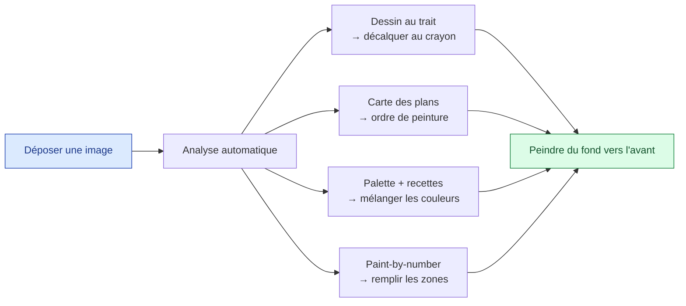

# Vision produit

> Pourquoi cet outil existe, ce qu'il vise à terme, et ce que couvre la première version.

---

## Le problème

Peindre une image réaliste à l'acrylique demande de répondre, avant de toucher un pinceau,
à trois questions :

1. **Quoi peindre ?** — quelles formes, quels contours.
2. **Dans quel ordre ?** — on peint du fond vers l'avant ; il faut identifier les plans.
3. **Avec quelles couleurs ?** — quelles teintes, et comment les obtenir par mélange.

Y répondre à l'œil est long et source d'erreurs. L'outil automatise cette préparation.

## Le but final

Un site web local en React/TypeScript où l'on **drag & drop une image** et où l'on
récupère une ou plusieurs **images adaptées** à ce que l'on veut faire. À terme, plusieurs
modes de rendu selon l'intention de l'artiste.

## Le flux de travail visé

## Périmètre de la V1

La première version se concentre sur la **préparation d'une image unique**, médium
**acrylique** par défaut. Elle produit quatre livrables :

| Livrable | Question traitée |
|----------|------------------|
| Dessin au trait | Quoi peindre (contours à décalquer) |
| Carte des plans | Dans quel ordre + couleur de fond de chaque plan |
| Palette + mélanges | Avec quelles couleurs (et comment les mélanger) |
| Paint-by-number | Où poser chaque couleur |

### Hors périmètre V1

- Plusieurs styles de rendu paramétrables (aquarelle, huile, stylisé…).
- Sauvegarde de projets, historique, comptes utilisateurs.
- Reconnaissance sémantique fine (« ceci est un arbre »).

Ces points pourront arriver une fois la chaîne de base validée.

## Principes de conception

| Principe | En pratique |
|----------|-------------|
| **Local d'abord** | Tout tourne sur la machine de l'artiste ; image jamais envoyée ailleurs. |
| **Une commande** | Backend et front se lancent et s'arrêtent ensemble. |
| **Pédagogique** | Les sorties expliquent (ordre, recettes), elles ne se contentent pas de transformer. |
| **Itératif** | Chaîne de base fonctionnelle d'abord, qualité affinée ensuite. |

## Ressources

- [Architecture générale](../02-architecture/architecture-generale.md)
- [Pipeline d'image](../03-pipeline-image/pipeline.md)
- [Couleurs & mélanges acryliques](../04-peinture/couleurs-acrylique.md)
