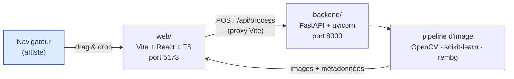
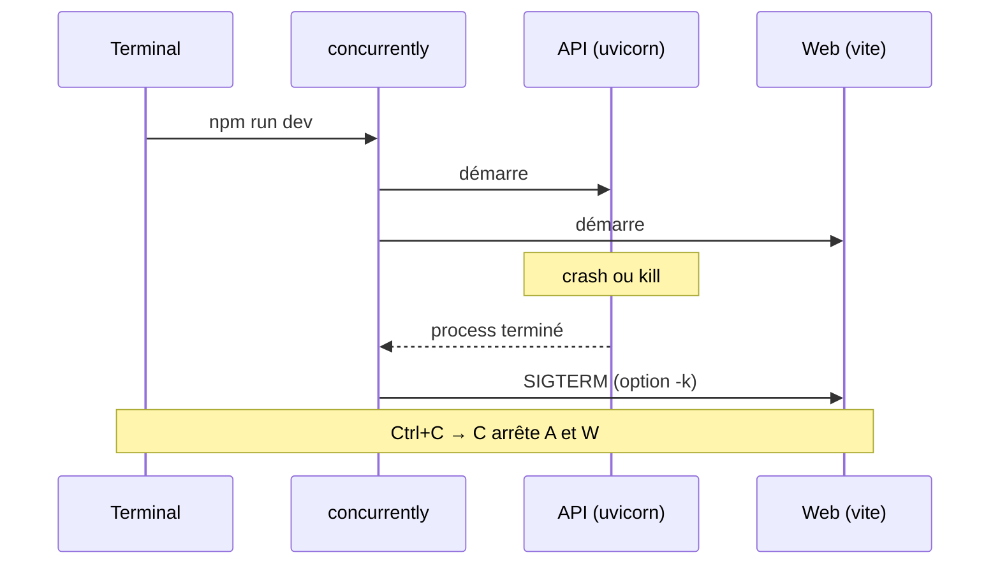
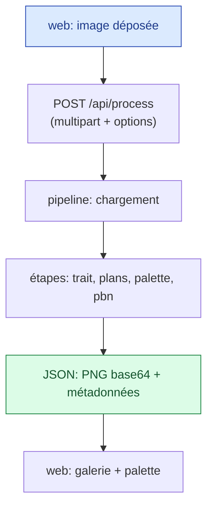

# Architecture générale

> Comment le projet est organisé : un monorepo à deux services (backend Python, front
> React) lancés et arrêtés par une seule commande, avec arrêt en cascade.

---

## Vue d'ensemble



Le front ne calcule rien : il envoie l'image et affiche ce que renvoie le backend. Tout
le traitement vit dans `backend/app/pipeline/`.

## Choix de stack

| Couche | Choix | Raison |
|--------|-------|--------|
| Front | Vite + React + TypeScript | Démarrage rapide, drag & drop natif, proxy `/api` intégré |
| API | FastAPI + uvicorn | Léger, typé (Pydantic), `--reload` en dev |
| Env Python | `uv` | Installation rapide et reproductible des dépendances |
| Vision IA | `rembg` + profondeur ONNX | Détourage et ordre des plans sans dépendre de `torch` |
| Vision classique | OpenCV, scikit-learn, Pillow, numpy | Contours, zones, quantification de couleurs |
| Orchestration | `concurrently -k` | Une commande, arrêt en cascade |

## Orchestration « une seule commande »

Le `package.json` à la racine pilote les deux services :

```bash
npm run dev
```

lance, via `concurrently` :

- `uv run --project backend uvicorn app.main:app --reload --port 8000`
- `npm --prefix web run dev`

### Arrêt en cascade



Le drapeau `-k` (`--kill-others`) garantit que si **l'un** des deux process s'arrête,
l'autre est tué immédiatement. `Ctrl+C` envoie `SIGINT` à `concurrently`, qui le propage
aux deux enfants.

> Le bash système de macOS est en 3.2 (pas de `wait -n`) : on s'appuie donc sur
> `concurrently` (Node) plutôt que sur un script shell pour gérer proprement la cascade.

## Arborescence

```
painting/
├── package.json          # orchestration (setup, dev, lint, test)
├── backend/
│   ├── pyproject.toml
│   └── app/
│       ├── main.py        # routes FastAPI
│       ├── schemas.py     # modèles Pydantic
│       └── pipeline/      # une étape = un module
├── web/
│   ├── vite.config.ts     # proxy /api → :8000
│   └── src/               # composants React
├── docs/
└── scripts/
```

## Flux d'une requête



## Ressources

- [Pipeline d'image](../03-pipeline-image/pipeline.md)
- [Contrat d'API](../05-api/contrat-api.md)
- [`concurrently`](https://github.com/open-cli-tools/concurrently)
- [`uv`](https://docs.astral.sh/uv/)
