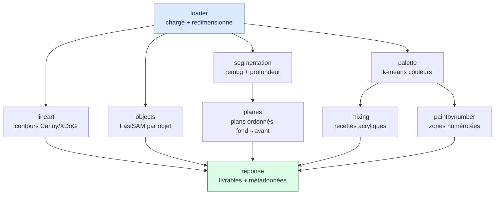

# Pipeline d'image

> Les étapes qui transforment l'image déposée en quatre livrables. Chaque étape est un
> module Python autonome dans `backend/app/pipeline/`.

---

## Vue d'ensemble

## Étapes

### loader

Charge l'image (Pillow), corrige l'orientation EXIF, convertit en RGB et redimensionne sur
le plus grand côté (par défaut 1024 px) pour borner le temps de calcul. Fournit un
`np.ndarray` aux autres modules.

### segmentation — IA

Deux signaux complémentaires :

| Signal | Outil | Rôle |
|--------|-------|------|
| Masque sujet / fond | `rembg` (U2Net, ONNX/CPU) | Isoler le ou les sujets de l'arrière-plan |
| Carte de profondeur | Depth-Anything v2 small (ONNX/CPU) | Estimer ce qui est devant / derrière |

> **Fallback** : si le modèle de profondeur n'est pas disponible, on approxime l'ordre des
> plans par une heuristique (position verticale + netteté locale). La chaîne reste
> fonctionnelle sans téléchargement lourd.

### planes — carte des plans

Quantifie la profondeur en *N* bandes (quantiles équilibrés) et produit des **couches
ordonnées de l'arrière vers l'avant**. Chaque plan reçoit :

- un **numéro d'ordre** (1 = à peindre en premier, le plus au fond) ;
- une **couleur de base** = couleur *dominante* du plan, c'est-à-dire la couleur de la
  palette qui couvre le plus de surface dans le plan. C'est une teinte franche, reliée à
  une recette de mélange (et non plus une médiane qui virerait au neutre/boueux).

Rendu : aplats francs des plans + fins liserés entre plans + numéro d'ordre.

### lineart — dessin au trait

Produit un trait noir **épuré et traçable**, pensé pour le **décalque au crayon** :

1. **lissage préservant les bords** pour fondre les textures (feuillage, herbe, tissu) en
   masses sans baver sur les vraies arêtes ;
2. **contours en couleur** : Canny sur chaque canal **Lab**, seuils calés sur les
   percentiles de gradient de chaque canal — les frontières purement chromatiques (rose
   sur violet de même luminosité, typiques des images pastel) sont détectées, là où un
   Canny en niveaux de gris ne les voit pas. En option : **XDoG** (style crayon,
   sélectionnable dans l'interface via `line_style`) ;
3. **renfort par zones de couleur** : les frontières de la quantification k-means (les
   mêmes que le paint-by-number, après filtre médian anti-tramage) sont fusionnées au
   trait → chaque masse à peindre a un contour à décalquer ;
4. **nettoyage** : fermeture morphologique + suppression des petites composantes (le
   « poivre et sel ») ;
5. **hiérarchie sujet/fond** via le masque `rembg` : le fond est lissé plus fort et filtré
   plus sévèrement → trait net sur le sujet, fond simplifié.

Le paramètre `detail` (0-100, défaut 50) règle la finesse : bas = fond très épuré, haut =
plus de détails ; à **100, aucun lissage** n'est appliqué (contours bruts, rendu type page
de coloriage détaillée). Le filtrage des petites composantes reste actif, donc même sans
lissage le trait n'est pas bruité.

### sepia — virage sépia

Applique la matrice sépia standard aux canaux RGB de l'image originale (teinte chaude
brun‑doré). Sortie : l'image virée en sépia.

### objects — contours objet par objet

Segmente l'image en **objets distincts** et trace le contour de chacun (façon coloriage
par objet), pour savoir quel élément peindre comme un tout.

- **FastSAM-x** (famille Segment Anything, mode « everything ») via ultralytics, sur CPU :
  segmente tous les objets sans clic (modèle surchargeable via `PAINTING_SAM_MODEL`).
  Résolution 1024 et seuil de confiance bas pour capter les structures fines.
- Les masques sont nettoyés (ouverture/fermeture morphologique) et leurs contours
  simplifiés (trait fin) ; un masque quasi pleine image (fond global) est ignoré.
- **Repli** (scikit-image, felzenszwalb) si le modèle est indisponible : régions
  cohérentes par couleur/texture. La chaîne reste fonctionnelle.

Les objets trop petits sont ignorés, les plus grands numérotés (jusqu'à 40).

### scene — objets nommés par plan

Combine un VLM, un segmenteur et la profondeur pour rattacher **chaque objet à son plan** :

1. **Florence-2** (VLM) décrit la scène (`<MORE_DETAILED_CAPTION>`) puis ancre les phrases
   en boîtes (`<CAPTION_TO_PHRASE_GROUNDING>`) → objets *nommés* + boîtes.
2. **SAM** box-promptable (`sam2.1_b` par défaut ; surchargeable par
   `PAINTING_OBJSAM_MODEL`, ex. un checkpoint SAM 3) transforme chaque boîte en masque net.
3. **profondeur médiane** de chaque objet → **plan + ordre de peinture**.

Rendu : chaque objet colorié selon son plan (fond → avant), numéroté ; la réponse fournit
aussi la description et la liste des objets (label, plan, couleur de base). Dégradable :
sans VLM (`PAINTING_NO_VLM=1`), repli sur les masques de `objects` avec labels génériques.

### palette — couleurs dominantes

`k-means` (scikit-learn) sur les pixels → *K* couleurs dominantes, chacune avec son code
hex et son pourcentage de surface. *K* est paramétrable.

### mixing — recettes acryliques

Pour chaque couleur de la palette, estime une **recette de mélange** à partir d'un jeu
d'acryliques primaires standard. Concentre le « savoir peintre ». Détails dans
[Couleurs & mélanges acryliques](../04-peinture/couleurs-acrylique.md).

### paintbynumber — gabarit

Quantifie l'image sur la palette, étiquette les **régions connexes** (OpenCV), trace leurs
frontières et inscrit le **numéro de couleur** dans chaque zone assez grande.

## Paramètres

| Paramètre | Défaut | Effet |
|-----------|--------|-------|
| `maxSize` | 1024 px | Borne le plus grand côté de l'image |
| `numColors` | 12 | Nombre de couleurs de la palette / du paint-by-number |
| `numPlanes` | 4 | Nombre de plans dans la carte des plans |
| `detail` | 50 | Finesse du dessin au trait (0 = fond épuré, 100 = brut sans lissage) |

## Performance

FastSAM (objets) et `rembg` (détourage) chargent leur modèle au premier appel ; ce sont
les étapes les plus coûteuses.
Le modèle est chargé une seule fois et réutilisé. Les étapes classiques (OpenCV,
scikit-learn) sont rapides sur une image bornée à ~1024 px.

## Ressources

- [Couleurs & mélanges acryliques](../04-peinture/couleurs-acrylique.md)
- [Contrat d'API](../05-api/contrat-api.md)
- [rembg](https://github.com/danielgatis/rembg)
- [OpenCV — Canny](https://docs.opencv.org/4.x/da/d22/tutorial_py_canny.html)
