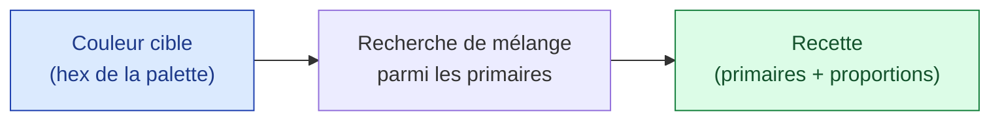

# Couleurs & mélanges acryliques

> Comment l'outil relie les couleurs détectées dans l'image à des **recettes de mélange**
> réalisables avec un jeu d'acryliques de base. C'est le « savoir peintre » du projet.

---

## Le principe : mélange soustractif

Les pigments **absorbent** la lumière : mélanger deux peintures donne une couleur plus
sombre que chacune. C'est le contraire de la lumière (écran, RGB additif). Pour estimer
une recette, on raisonne donc en **soustractif**, pas en simple moyenne RGB.

## Le jeu de base (palette physique)

On part d'un set d'acryliques courant et polyvalent :

| Primaire | Rôle |
|----------|------|
| Blanc de titane | Éclaircir, opacité |
| Jaune primaire (azo) | Jaunes, verts, oranges |
| Magenta / rouge primaire | Rouges, roses, violets |
| Cyan / bleu primaire | Bleus, verts, turquoise |
| Bleu outremer | Bleus profonds, ombres |
| Terre d'ombre brûlée | Bruns, neutralisation, tons chair |
| Noir de mars | Assombrir (avec parcimonie) |

> En peinture, on assombrit plutôt avec une **complémentaire** ou une terre qu'avec du noir
> pur, qui ternit. L'outil privilégie ces approches dans ses suggestions.

## De la couleur cible à la recette

1. La palette fournit une **couleur cible** (hex) par k-means.
2. On cherche la **combinaison de primaires** dont le mélange soustractif approche la
   cible, avec des proportions simples (ex. *2 parts cyan + 1 part jaune + une pointe de
   blanc*).
3. On renvoie la recette + un **écart estimé** (à quel point l'approximation est fiable).

### Modèle de mélange

L'estimation se fait dans un espace perceptuel (proche de la vision humaine) plutôt qu'en
RGB brut, pour que « proche » veuille dire « proche à l'œil ». Le mélange de primaires est
approché par un modèle soustractif simple, suffisant pour guider l'artiste — ce n'est pas
une simulation physique exacte des pigments.

| Étape | Ce qu'on calcule |
|-------|------------------|
| Cible | hex → composantes perceptuelles |
| Candidats | mélanges de 2-3 primaires, proportions discrètes |
| Score | distance perceptuelle cible ↔ mélange |
| Choix | mélange le plus proche, proportions arrondies |

## Limites assumées

- Les recettes sont **pédagogiques**, pas garanties au pigment près : marques et opacités
  varient.
- Les couleurs très saturées ou fluo peuvent être hors d'atteinte du jeu de base ; l'outil
  le signale par un écart élevé.
- Le rendu écran d'une couleur dépend de l'étalonnage : à valider à l'œil sur palette.

## Lien avec l'ordre de peinture

La [carte des plans](../03-pipeline-image/pipeline.md) donne, pour chaque plan, une
**couleur de fond** : la teinte de base à poser en premier sur ce plan avant les détails.
On peint cette base du plan le plus au fond vers l'avant, puis on affine.

## Ressources

- [Pipeline d'image](../03-pipeline-image/pipeline.md)
- [Vision produit](../01-vision/objectif-produit.md)
- [Color mixing — notions](https://en.wikipedia.org/wiki/Color_mixing)
