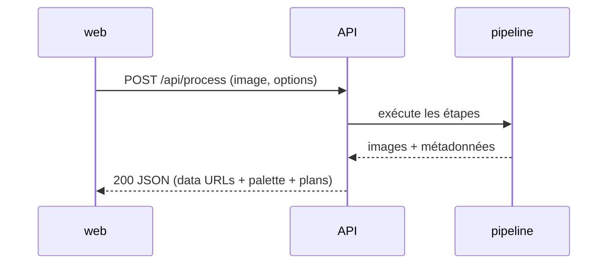

# Contrat d'API

> Endpoints exposés par le backend FastAPI, formats d'entrée et de sortie. Le front est le
> seul client ; tout transite en local.

---

## Endpoints

| Méthode | Chemin | Rôle |
|---------|--------|------|
| `GET` | `/api/health` | Vérifier que le backend répond |
| `POST` | `/api/process` | Analyser une image et renvoyer les livrables |

## `GET /api/health`

Réponse `200` :

```json
{ "status": "ok" }
```

## `POST /api/process`

Requête `multipart/form-data` :

| Champ | Type | Défaut | Description |
|-------|------|--------|-------------|
| `image` | fichier | — | Image à analyser (PNG/JPEG) |
| `num_colors` | entier | 12 | Taille de la palette / du paint-by-number |
| `num_planes` | entier | 4 | Nombre de plans dans la carte des plans |
| `detail` | entier | 50 | Finesse du dessin au trait (0-100 ; 100 = sans lissage) |

### Réponse `200`

Les images sont encodées en **PNG base64** (préfixe `data:image/png;base64,...`) pour un
affichage direct dans le front.

```json
{
  "lineart": "data:image/png;base64,...",
  "sepia": "data:image/png;base64,...",
  "objectContours": "data:image/png;base64,...",
  "objectPlanes": "data:image/png;base64,...",
  "sceneDescription": "A little boy sitting on a blanket...",
  "sceneObjects": [
    { "index": 1, "label": "A little boy", "plane": 4,
      "planeLabel": "premier plan", "baseColor": "#73664e" }
  ],
  "planesMap": "data:image/png;base64,...",
  "paintByNumber": "data:image/png;base64,...",
  "palette": [
    { "index": 1, "hex": "#3a5f8a", "pct": 24.1,
      "recipe": { "parts": [
        { "primary": "Cyan", "parts": 2 },
        { "primary": "Bleu outremer", "parts": 1 },
        { "primary": "Blanc de titane", "parts": 1 }
      ], "deltaE": 4.2 } }
  ],
  "planes": [
    { "order": 1, "baseColor": "#9fb7c9", "baseColorIndex": 3, "label": "arrière-plan" }
  ]
}
```

### Champs de la réponse

| Champ | Type | Description |
|-------|------|-------------|
| `lineart` | string | Dessin au trait (data URL PNG) |
| `sepia` | string | Image virée en sépia (data URL PNG) |
| `objectContours` | string | Contours objet par objet (data URL PNG) |
| `objectPlanes` | string | Objets nommés coloriés par plan (data URL PNG) |
| `sceneDescription` | string | Description de la scène par le VLM |
| `sceneObjects` | tableau | Objets : `index`, `label`, `plane`, `planeLabel`, `baseColor` |
| `planesMap` | string | Carte des plans coloriés + numéros (data URL PNG) |
| `paintByNumber` | string | Gabarit à zones numérotées (data URL PNG) |
| `palette` | tableau | Couleurs dominantes : `index`, `hex`, `pct`, `recipe` |
| `palette[].recipe` | objet | `parts` (primaire + nombre de parts) et `deltaE` (écart estimé) |
| `planes` | tableau | Plans ordonnés : `order` (1 = fond), `baseColor`, `baseColorIndex` (renvoie à la palette), `label` |

### Erreurs

| Code | Cas |
|------|-----|
| `400` | Fichier manquant ou format d'image non lisible |
| `422` | Paramètre invalide (ex. `num_colors` hors bornes) |
| `500` | Erreur interne du pipeline |

## Flux



## Ressources

- [Pipeline d'image](../03-pipeline-image/pipeline.md)
- [Architecture générale](../02-architecture/architecture-generale.md)
- [FastAPI](https://fastapi.tiangolo.com/)
