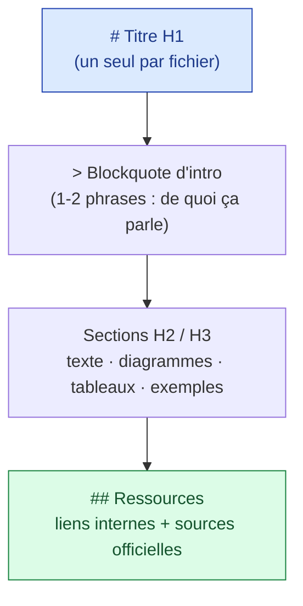
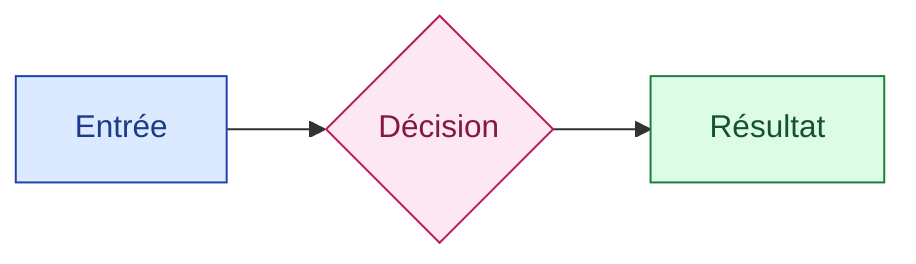
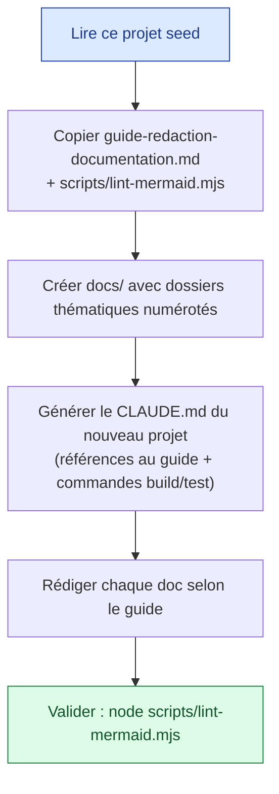

# Guide de rédaction de la documentation

> Standard portable pour rédiger une documentation lisible, maintenable et bien rendue. Ce guide est **conçu pour être copié/adapté dans tout nouveau projet** : il définit *comment* documenter, indépendamment du sujet documenté.

---

## À quoi sert ce guide

Ce dépôt sert de **modèle d'amorçage** (seed) pour instancier de nouveaux projets. Quand Claude lit ce projet pour en démarrer un autre, il doit :

1. **Appliquer** ces conventions à la documentation qu'il crée.
2. **Recopier** ce guide (+ `scripts/lint-mermaid.mjs`) dans le nouveau projet.
3. **Générer** un `CLAUDE.md` qui pointe vers ce guide comme standard de rédaction.

Voir la section [Bootstrap d'un nouveau projet](#bootstrap-dun-nouveau-projet).

---

## Principes

| Principe | En pratique |
|----------|-------------|
| **Le lecteur d'abord** | Écrire pour qui lira, pas pour qui sait déjà. Définir les termes avant de les utiliser. |
| **Scannable** | Titres clairs (H2/H3), tableaux, listes. On doit comprendre en survolant. |
| **Une idée par document** | Un fichier = un sujet. Si ça dépasse ~400 lignes, scinder. |
| **À jour > exhaustif** | Une info fausse est pire qu'absente. Dater, sourcer, et corriger en priorité. |
| **Montrer, pas seulement dire** | Diagrammes, exemples copiables, avant/après. |
| **Lien plutôt que duplication** | Référencer un autre document au lieu de répéter son contenu. |

---

## Contraintes de rendu (le *pourquoi* des règles)

La documentation est lue dans un **viewer Markdown** (et sur GitHub). Ces contraintes en découlent et ne sont **pas négociables** :

| Règle | Pourquoi |
|-------|----------|
| **Diagrammes en Mermaid**, jamais en ASCII-art (`┌─┐`) | Les blocs ` ```mermaid ` sont rendus en **SVG responsive** ; l'ASCII-art s'affiche en monospace et **déborde** de la colonne de lecture (et casse sur mobile). |
| **Tableaux GFM** (`\| … \|`) pour les comparaisons | Rendus en vrais tableaux HTML stylés ; les cellules s'adaptent à la largeur. |
| **Pas de frontmatter YAML** en tête des `.md` de contenu | Non supporté par le viewer : il s'afficherait en texte brut. |
| **Blocs de code étroits** (≤ ~88 colonnes) | Un `<pre>` ne se replie pas → toute ligne trop large scrolle horizontalement. |
| **Liens `.md` relatifs** entre documents | Traités comme navigation interne ; garder des chemins relatifs corrects. |

> Réserver les blocs de code « texte » (` ``` `) aux **arborescences de fichiers** et aux **exemples de code** — jamais à des schémas en box-drawing.

---

## Structure d'un document

Tout document suit la même ossature, prévisible :



1. **Titre H1** unique, suivi d'une **description en blockquote**.
2. Séparateur `---`, puis le corps en sections **H2/H3** logiques.
3. Une section finale **« Ressources »** (liens internes pertinents + sources officielles).
4. Cibler **200-400 lignes** pour un guide ; au-delà, scinder.

---

## Diagrammes Mermaid

### Types à privilégier

| Type | Usage |
|------|-------|
| `flowchart TD` / `LR` | Architectures, hiérarchies, flux de décision |
| `sequenceDiagram` | Échanges ordonnés entre acteurs (client/serveur, hooks) |
| `stateDiagram-v2` | Cycles de vie, machines à états |
| `classDiagram` | Relations structurelles entre concepts/types |

### Règles de syntaxe (pour garantir le rendu)

- **Quoter** tout label contenant parenthèses, deux-points, virgules, slashs ou caractères spéciaux : `A["Auto-Accept (édits)"]`.
- Utiliser `<br/>` pour les retours à la ligne dans un label.
- **Jamais** de mot réservé comme identifiant de nœud (`end`, `class`, `style`, `subgraph`, `graph`, `state`). Préférer `A`, `N1`, `Core`…
- Réutiliser une **palette cohérente** (optionnel) :



### Validation

Valider **chaque** diagramme avant de committer :

```bash
node scripts/lint-mermaid.mjs            # tous les .md de docs/
node scripts/lint-mermaid.mjs README.md  # un fichier précis
```

Le linter détecte les erreurs les plus fréquentes (parenthèses non quotées, mots réservés, crochets/guillemets déséquilibrés).

---

## Langue et style

- **Contenu en français** ; **termes techniques en anglais** (hooks, subagents, skills, prompt, etc.).
- Orthographe complète avec accents (jamais d'ASCII dégradé : « modèle », pas « modele »).
- **Gras** pour les points clés ; `>` blockquote pour les notes importantes.
- Blocs de code **avec langage spécifié** (` ```bash `, ` ```json `, ` ```ts `).
- Phrases courtes, voix active, impératif pour les instructions.

---

## Organisation et nommage

- Fichiers en **kebab-case** descriptif : `memory-system.md`, pas `ms.md`.
- Regrouper par thème dans des dossiers numérotés (`01-fondamentaux/`, `02-configuration/`…) pour un ordre de lecture clair.
- Un `README.md` par dossier important, listant ses fichiers (table de navigation).
- **Liens croisés** entre documents liés (`[texte](../dossier/fichier.md)`).

---

## Checklist de relecture

| ✓ | Point |
|---|-------|
| ☐ | H1 unique + blockquote d'intro |
| ☐ | Aucun schéma ASCII-art (`┌─┐`) — tout en Mermaid |
| ☐ | `node scripts/lint-mermaid.mjs` passe (✓) |
| ☐ | Tableaux GFM pour les comparaisons |
| ☐ | Pas de frontmatter dans les `.md` de contenu |
| ☐ | Blocs de code ≤ ~88 colonnes, langage spécifié |
| ☐ | Liens internes `.md` valides (pas de chemin cassé) |
| ☐ | Section « Ressources » + sources officielles datées |
| ☐ | Français correct et accentué ; termes techniques en anglais |
| ☐ | ≤ 400 lignes (sinon scinder) |

---

## Bootstrap d'un nouveau projet

Quand Claude utilise ce dépôt pour amorcer un nouveau projet :



**Procédure** :

1. **Copier** ce guide et `scripts/lint-mermaid.mjs` dans le nouveau projet (`docs/` et `scripts/`).
2. **Créer** l'arborescence `docs/` adaptée au domaine du projet (dossiers numérotés).
3. **Générer** le `CLAUDE.md` du nouveau projet en y incluant le bloc « Convention de documentation » ci-dessous.
4. **Rédiger** chaque document selon ce guide, puis **valider** avec le linter.

### Bloc à insérer dans le `CLAUDE.md` du nouveau projet

```markdown
## Convention de documentation

La documentation suit `docs/06-ressources/guide-redaction-documentation.md` :
- Schémas en **Mermaid** (jamais d'ASCII-art) ; valider via `node scripts/lint-mermaid.mjs`.
- Pas de frontmatter dans les `.md` de contenu ; tableaux GFM ; liens `.md` relatifs.
- H1 + blockquote d'intro, sections H2/H3, section « Ressources » finale.
- Contenu en français, termes techniques en anglais, ≤ 400 lignes/doc.
```

---

## Ressources

- [Guide CLAUDE.md](../02-configuration/claude-md-guide.md) — structurer le fichier d'identité du projet
- [Cheatsheet](./cheatsheet.md) — aide-mémoire rapide
- `scripts/lint-mermaid.mjs` — validateur de syntaxe Mermaid du dépôt
- [Mermaid — documentation officielle](https://mermaid.js.org/)
- [GitHub Flavored Markdown](https://github.github.com/gfm/)
