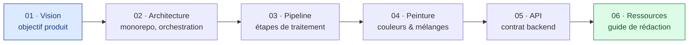

# Documentation — painting

> Point d'entrée de la documentation du projet. Chaque dossier traite un thème ; les
> documents suivent le standard de rédaction du seed (Mermaid, tableaux GFM, français).

---

## Navigation



## Sommaire

| Dossier | Contenu |
|---------|---------|
| [`01-vision/`](01-vision/objectif-produit.md) | Pourquoi l'outil existe, but final, périmètre V1 |
| [`02-architecture/`](02-architecture/architecture-generale.md) | Monorepo, orchestration une commande, arrêt en cascade |
| [`03-pipeline-image/`](03-pipeline-image/pipeline.md) | Les étapes de l'analyse d'image et leurs livrables |
| [`04-peinture/`](04-peinture/couleurs-acrylique.md) | Théorie des couleurs et recettes de mélange acrylique |
| [`05-api/`](05-api/contrat-api.md) | Endpoints, formats d'entrée/sortie |
| [`06-ressources/`](06-ressources/guide-redaction-documentation.md) | Standard de rédaction (copié du seed) |

## Convention

Voir [`06-ressources/guide-redaction-documentation.md`](06-ressources/guide-redaction-documentation.md).
Valider les diagrammes avant de committer :

```bash
node scripts/lint-mermaid.mjs
```
